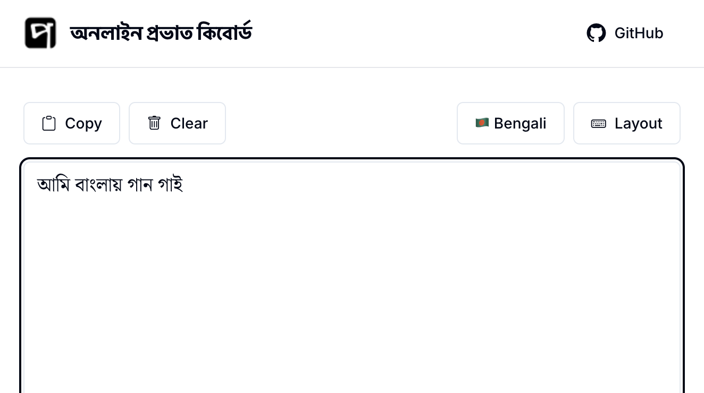
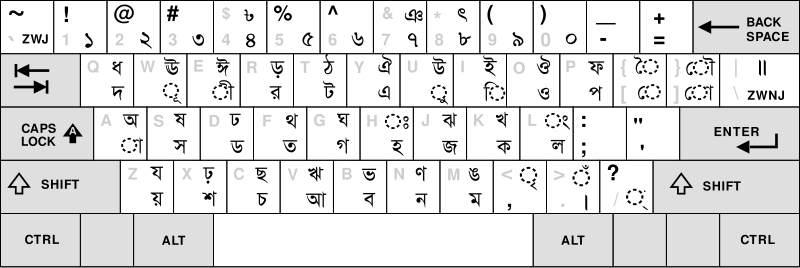

# probhat-web 🌐
**অনলাইন প্রভাত কিবোর্ড | Online Probhat Keyboard**

Type in Bengali (বাংলা) using the popular Probhat keyboard layout directly in your web browser, without installing any software or extensions.

## ✨ Features

- 🌐 **Web-based**: No installation required, works in any modern browser
- 📱 **Mobile-friendly**: Responsive design that works on all devices
- ⌨️ **Probhat Layout**: Uses the beloved Probhat keyboard layout familiar to Bengali users
- 📋 **Copy/Clear**: Easy text management with one-click copy and clear functions

## 📚 About jQuery.IME

This project is powered by [jQuery.IME](https://github.com/wikimedia/jquery.ime), a robust input method editor library that supports over 135 input methods across 62+ languages. Originally developed by the Wikimedia Foundation and enhanced by contributions from Red Hat and the global community, jQuery.IME is trusted and used across all Wikimedia projects including Wikipedia.

## ⌨️ Keyboard Layout

The Probhat keyboard layout is designed for intuitive Bengali typing. Here's the complete layout reference:

## 🚧 Roadmap & TODO

### ✅ Completed
- [x] Support mobile browsers
- [x] Remove bootstrap.css dependency
- [x] Modern Bootstrap 5 UI redesign
- [x] Noto Serif Bengali font integration
- [x] Responsive design improvements
- [x] Save text to local storage

### 🔮 Planned Features
- [ ] ⚠️ Warn user when closing with unsaved content
- [ ] 🌙 Dark mode toggle
- [ ] 🎨 Customizable themes

## 🔗 Related Projects

- [jQuery.IME](https://github.com/wikimedia/jquery.ime) - The core input method engine
- [Avro.im](https://avro.im/) - Online Avro keyboard for Bengali typing
- [Bengali Input Methods](https://en.wikipedia.org/wiki/Bengali_input_methods) - Wikipedia article on Bengali typing methods

---

  Made with ❤️ for the Bengali community 
  <a href="https://probhat.mdminhazulhaque.io/">Try it now!</a>

